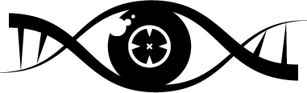

# SVbyEye 

<!-- badges: start -->
[](https://github.com/daewoooo/SVbyEye/actions/workflows/R-CMD-check.yaml)
<!-- badges: end -->

===================================================================================\
R Package to visualize alignments between two or multiple DNA sequences. There are \
number of functionalities to facilitate to process alignments in PAF format.

Author: David Porubsky

## Installation

### Development version from Github
To install the development version from Github, follow the steps given below. The installation has only been tested on Linux (Ubuntu) system, if you need to install on Windows or Mac-OS additional steps might be necessary.

1. Install a recent version of R (>=4.2) from https://www.r-project.org/  
   Under Linux make sure current version of r-base & r-base-dev is installed.  
   Under Windows it is recommended to install recent version of Rtools from https://cran.r-project.org/bin/windows/Rtools/\
2. Optional: For ease of use, install Rstudio from https://www.rstudio.com/
3. Open R or RStudio and execute the following lines one by one (Please ensure that you have writing permissions to install packages):

```{r}
## Install required packages
install.packages("devtools")
library(devtools)

## Install from GitHub repository
devtools::install_github("daewoooo/SVbyEye", branch="master")
```	  

## Documentation
See [here](https://htmlpreview.github.io/?https://github.com/daewoooo/SVbyEye/blob/master/man/doc/SVbyEye.html) for a detailed package usage.
	
## Report Errors
If you encounter errors of any kind or want to request a new package functionality, please report an [issue here](https://github.com/daewoooo/SVbyEye/issues/new).

## NOTE
Currently the SVbyEye package is under active development and contains unpublished work. We are currently actively working on a manuscript presenting this tool. Stay tuned for upcoming citation by the end of 2023. Please contact me if there are any question as to how to cite this tools in your work. 

